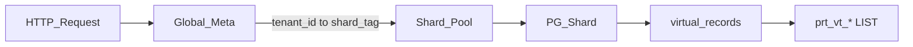

# Virtual-Records unified storage (evolution RFC)

> **Status: implemented and the only storage path** (no `TENANT_ISOLATION_MODE` switch).  
> Old `lc_dynamic_rows` / `dedicated_db` / `shared_db` physical-table isolation has been removed (breaking).

## Overview

**Goal:** all low-code business records live in one global table per business PG shard. Isolation of logical tables uses **LIST partition by `vt_id`**. Horizontal sharding of business data uses **`tenant_id`** (different tenants land on different PG shard instances).

**Covers:** partition model, shard routing, index auto-migrate, filter / full-text, multi-hop Lookup, Rollup, constraints, boundaries, unsupported cases.

**Decisions:**

| Item | Decision |
|------|----------|
| `vt_id` | **Globally unique** (UUID or prefixed global ID); logical display name (e.g. `order`) is separate from `vt_id` |
| Partition key | `PARTITION BY LIST (vt_id)`; uniqueness includes the partition key: `PRIMARY KEY (vt_id, record_id)` |
| Hierarchy | **`Tenant ⊃ Base ⊃ Table`**; shard routing key is `tenant_id`; a tenant **does not span shards** |
| Full text | App maintains `data._fulltext_text` + partial GIN (**no** pg_jieba dependency) |
| PG version | Business shards should be **PostgreSQL 14+** (`CREATE INDEX CONCURRENTLY` on partitioned tables) |



### Core architecture

| Component | Role |
|-----------|------|
| **Global-Meta** (dedicated PG) | Tenants, metamodel `virtual_tables` / `virtual_columns`, shard routing, usage stats |
| **Business PG shard** (`pg-shard-101`…) | One parent table `virtual_records` per shard, LIST-partitioned by `vt_id`; all data for a tenant lives on one shard |

New tenants are placed on a shard that still has capacity; **existing tenants are not auto-migrated** (migration is an ops job).

The implemented table name is `record` (evolved from `virtual_records`). Tenants with `record_store=dedicated` use `{tenant_id}_record` on the same data DSN instead of the shared parent.

### Contrast with previous production

| Dimension | Previous | This RFC target |
|-----------|----------|-----------------|
| Meta | Dedicated Meta DB (`lc_*`) | Still dedicated Global-Meta (table names may evolve) |
| Data routing | `tenant_id` → `lc_tenants.data_dsn` | `tenant_id` → `tenants.data_dsn` |
| Row storage | Per-logical-table physical table, or `lc_dynamic_rows` JSONB | Single table `virtual_records` + LIST child partitions |
| Isolation | Tenant (+ optional schema / RLS) | Whole tenant on one shard |
| Indexes | Physical column indexes / RLS shared GIN | Parent **partial** expression indexes (`WHERE vt_id = …`) |

---

## 1. Identity and naming

| ID | Scope | Notes |
|----|-------|-------|
| `tenant_id` | Globally unique | **Isolation unit + shard routing key**; all tenant data on one shard |
| `base_id` | Globally unique | Logical database / app inside a tenant (≈ former `schema_name` grouping); one Base, many Tables |
| `vt_id` | **Globally unique** | Logical table instance ID; **LIST partition key**; not the user-visible name |
| `record_id` | Unique within one `vt_id` | May repeat across `vt_id` values |

Headers: `X-Tenant-Id` (required), `X-Base-Id` (Base-scoped APIs; defaults to the first Base in the tenant). Meta no longer uses `schema_name` / `lc_tenants` as the routing identity.

Logical names (e.g. `order`) are display / API aliases only. **Partition names** should be `prt_<vt_id_sanitized>`, not `prt_vt_order` (that would imply the logical name is the partition key). Multiple tenants on one shard can each have an “orders” table with distinct global `vt_id` values.

**Multiple tenants in one partition?** With globally unique `vt_id` and each logical table belonging to one tenant, each LIST child partition serves one tenant. Even if a shared `vt_id` exception appears later, **all business SQL must include a `tenant_id` predicate**.

---

## 2. Table definition (per business shard)

```sql
-- Parent table on a business shard: all tenants, all logical tables
CREATE TABLE record (
    record_id       TEXT NOT NULL,
    tenant_id           TEXT NOT NULL,
    vt_id           TEXT NOT NULL,
    data            JSONB NOT NULL DEFAULT '{}'::jsonb,
    created_at      TIMESTAMPTZ NOT NULL DEFAULT NOW(),
    updated_at      TIMESTAMPTZ NOT NULL DEFAULT NOW(),
    created_by      TEXT,
    updated_by      TEXT,
    PRIMARY KEY (vt_id, record_id)
) PARTITION BY LIST (vt_id);

-- Optional hot-path helpers (prefer partial indexes that include vt_id, or indexes on children)
CREATE INDEX idx_vr_ws ON virtual_records (tenant_id);
CREATE INDEX idx_vr_ctime ON virtual_records (created_at);
```

### Partition rule

Each new logical table (`virtual_table`) dynamically creates a LIST child on **the tenant’s shard**:

```sql
-- vt_id is a globally unique ID (readable placeholder; production uses UUID / prefixed ID)
CREATE TABLE prt_vt_01hxyz PARTITION OF virtual_records
  FOR VALUES IN ('vt_01hxyz');
```

### Properties

- Parent `virtual_records` **holds no business rows**; data lives in `prt_*` children.
- Queries with `vt_id = '…'` get partition pruning.
- **Business queries must also include `tenant_id`** (injected by the app), even if the partition currently belongs to one tenant.
- JOIN / Link / Lookup / Rollup can run on the same shard; **cross-shard database JOINs are not allowed**.

Reserved `data` keys (do not collide with business fields): `_fulltext_text`, `_rollup_*`, etc.

---

## 3. Horizontal sharding by `tenant_id`

### 3.1 Global-Meta core tables

```sql
CREATE TABLE pg_shards (
    shard_tag TEXT PRIMARY KEY,
    dsn_ref TEXT NOT NULL,              -- secret/config ref, not plaintext password
    max_tenant_count INT NOT NULL DEFAULT 1000,
    status TEXT NOT NULL,              -- active / drain / offline
    created_at TIMESTAMPTZ DEFAULT NOW()
);

-- Background worker writes COUNT(tenants) snapshots; do not scan data system catalogs for placement
CREATE TABLE pg_shard_stats (
    shard_tag TEXT PRIMARY KEY REFERENCES pg_shards(shard_tag),
    current_tenant_count INT NOT NULL DEFAULT 0,
    updated_at TIMESTAMPTZ DEFAULT NOW()
);

CREATE TABLE tenants (
    tenant_id TEXT PRIMARY KEY,
    pg_instance_tag TEXT NOT NULL REFERENCES pg_shards(shard_tag),
    name TEXT,
    label TEXT,
    status TEXT,
    created_at TIMESTAMPTZ
);

CREATE TABLE lc_bases (
    base_id TEXT PRIMARY KEY,
    tenant_id TEXT NOT NULL REFERENCES tenants(tenant_id),
    name TEXT,
    label TEXT,
    status TEXT
);
```

**Quota:** Tenant count (`max_tenant_count` / `current_tenant_count`, default cap 1000). LIST partitions remain per `vt_id` (one table, one partition), independent of placement quota.

### 3.2 Auto-placement for new tenants

1. Query `pg_shards JOIN pg_shard_stats` for `status = active` and `current_tenant_count < max_tenant_count`.
2. Prefer the shard with the **largest remaining tenant capacity**.
3. Atomically insert `tenants` with `pg_instance_tag`, seed a default `lc_bases`.
4. Process memory keeps `shard_tag → *sql.DB` pools.

**Request routing:** `tenant_id` → Global-Meta `shard_tag` → corresponding pool.

### 3.3 Constraints

| | |
|--|--|
| ✅ | All data for a tenant on one shard; no splitting a tenant across shards |
| ✅ | Auto-placement applies to **new** tenants only; existing ones are not moved |
| ✅ | Tenant move: ops tool copies all partition data → verify → atomically update `tenants.pg_instance_tag` → clean old shard; target shard needs a full Index Migrate |
| ❌ | Cross-shard PG JOIN / DB-level Lookup / Rollup; assemble in the application if needed |

---

## 4. Index Migrate

Metamodel `virtual_columns` drives indexes; the low-code UI configures whether to index, index type, and full-text.

Indexes are created on parent `virtual_records` as **PARTIAL** indexes `WHERE vt_id = '…'`. LIST children inherit the definition; per-child DDL is not required.

### Meta fields

```text
need_index: boolean          -- create an index
index_type: enum(btree, gin)
index_expr: text             -- PG index expression relative to data / column path
enable_fulltext: boolean     -- participate in full text (write _fulltext_text)
```

### Examples

```sql
-- string equality
CREATE INDEX idx_vt_01hxyz_order_no
ON virtual_records ((data->>'order_no'))
WHERE vt_id = 'vt_01hxyz';

-- numeric
CREATE INDEX idx_vt_01hxyz_amount
ON virtual_records (((data->>'total_amount')::numeric))
WHERE vt_id = 'vt_01hxyz';

-- Link (jsonb array) GIN for Lookup / relation filters
CREATE INDEX idx_vt_01habc_link_order
ON virtual_records USING GIN ((data->'vc_order'))
WHERE vt_id = 'vt_01habc';
```

**Do not** create global JSONB indexes like `CREATE INDEX … ON virtual_records (data)` (write amplification). Prefer per-`vt_id` partial indexes.

### Migrate flow

1. User saves field index config to the metamodel.
2. Migrate worker routes to the tenant’s business shard:
   - `need_index = true`: `CREATE INDEX CONCURRENTLY` if missing;
   - `need_index = false`: `DROP INDEX CONCURRENTLY` if present.
3. Idempotent: compare desired definition to catalog; retry on failure; DDL and metamodel converge.
4. **PostgreSQL 14+**: partitioned parent supports `CREATE INDEX CONCURRENTLY` (concurrent build per partition). Below 14, use per-partition non-blocking strategy or a write pause (not recommended here).

After a tenant moves to a new shard, run a full Index Migrate for all `vt_id` values on that tenant.

Each shard enables `pg_stat_statements` independently to find missing indexes (do not query system catalogs on the business path for placement).

---

## 5. Full-text search (single vt)

**Need:** keyword match on full-text-enabled fields in the current `vt`; same shard, same `vt_id`; not across vt or shard.

### Options

| Approach | Extension | Lookup | Fit |
|----------|-----------|--------|-----|
| pg_jieba + tsvector GIN | Needs preload + often restart | Cannot index Lookup directly; merge at query time | Self-managed clusters |
| **App `_fulltext_text` (recommended)** | No extension | Can denormalize Lookup display values on write | SaaS multi-shard / cloud RDS |

### Recommended: `_fulltext_text`

- Fields with `enable_fulltext = true`: concatenate text into `data._fulltext_text` on Insert / Update.
- Lookup in full text: denormalize display values on write; source changes must **cascade-refresh** dependents’ `_fulltext_text`.
- Partial GIN:

```sql
CREATE INDEX idx_fts_vt_01hxyz
ON virtual_records USING GIN (to_tsvector('simple', data->>'_fulltext_text'))
WHERE vt_id = 'vt_01hxyz';
```

```sql
SELECT * FROM virtual_records
WHERE vt_id = 'vt_01hxyz'
  AND tenant_id = $ws
  AND to_tsvector('simple', data->>'_fulltext_text')
      @@ to_tsquery('simple', '1001');
```

### Boundaries

- `tsvector` is token matching, **not** arbitrary substring `%xxx%`; contiguous fragments without separators may miss.
- Full text is single-vt; cross-vt / cross-shard needs an external search engine (e.g. Meilisearch).
- **Do not** filter with per-row `to_tsvector()` without an index (full partition scan + CPU).

### pg_jieba (optional, not default)

Cloud RDS `shared_preload_libraries` often requires restart; every shard must match; query and index `jiebacfg` must be identical or the index is useless.

---

## 6. Multi-hop Lookup (same shard)

Lookup: follow Link to another vt and take a target field; **computed at query time via JOIN**, not persisted on this row’s `data` (except full-text denormalization).

Multi-hop: A → B → C lets A look up C’s field.

### Storage

- Link stored as a jsonb array on `data`, e.g. `"vc_order": ["rec-001"]`.
- Link fields get a GIN partial index for `@>` containment.

### Constraints

- Lookup results **cannot** be the primary filter path via an expression index.
- When a filter hits a Lookup field: the query engine **pushes down** to the source physical field and uses source indexes; do not “JOIN then filter the outer result in memory”.
- All JOINs must be on the same shard; no DB-level Lookup across shards.

### Wrong vs right

```sql
-- ❌ outer filter on Lookup alias (often cannot use source indexes)
SELECT * FROM (
  SELECT a.*, c.data->>'c_field' AS lk_c_field
  FROM virtual_records a
  LEFT JOIN virtual_records b ON ...
  LEFT JOIN virtual_records c ON ...
) t WHERE t.lk_c_field = 'xxx';
```

Correct rewrite (`lk_c_field = 'xxx'`):

1. Filter C on the physical field → C `record_id` set;
2. Filter B via Link GIN → B set;
3. Filter A via Link GIN → return A.

Full text on Lookup: query-time FTS on the source vt then join back; or write-time denormalize into `_fulltext_text` (with cascade refresh).

---

## 7. Rollup (same shard)

Aggregate a child set (sum / count / max / min / avg) as a virtual field on the parent.

### Mode A: live Rollup at query time

Same-shard subquery + aggregate; fits small data / infrequent lists.

```sql
SELECT
  o.*,
  (SELECT SUM((i.data->>'price')::numeric)
   FROM virtual_records i
   WHERE i.vt_id = 'vt_01habc'
     AND i.tenant_id = o.tenant_id
     AND i.data->'vc_order' @> jsonb_build_array(o.record_id)
  ) AS rl_total_price
FROM virtual_records o
WHERE o.vt_id = 'vt_01hxyz'
  AND o.tenant_id = $ws;
```

Depends on child Link GIN; paginated large lists amplify latency per related subquery.

### Mode B: precompute (recommended for large subsets)

On child insert/update/delete, trigger or app updates parent `data._rollup_*`; list reads the pre-aggregate. Cost: write amplification; hot child updates hit the parent.

### Constraints

- Same shard only; tenants do not span shards, so in-tenant Rollup can use the DB.
- Multi-hop Rollup (A←B←C) should precompute; nested live subqueries perform poorly.

---

## 8. Limits and unsupported cases

| | |
|--|--|
| ❌ | Cross-shard PG JOIN / Lookup / Rollup (assemble in the app) |
| ❌ | Splitting one tenant’s data across shards |
| ❌ | Efficient arbitrary substring `%xxx%` (needs external search) |
| ❌ | Automatic tenant rebalance; moves are whole-tenant ops jobs |
| ✅ | Metamodel DDL and Index Migrate **must** route to the tenant’s shard; never write business rows on Global-Meta |

---

## 9. Ops and monitoring

1. **Partition stats worker:** walk all shards, count LIST children and tenants, write `pg_shard_stats` (placement + alerts).
2. **Slow queries:** per-shard `pg_stat_statements` to find missing indexes.
3. **Usage worker:** disk by `tenant_id` / `vt_id`, write back to Global-Meta (monitor / billing).
4. **Bloat:** monitor; high-write workloads should `VACUUM ANALYZE` regularly.

---

## 10. Out of scope for this RFC

This file does **not** cover final HTTP API names, online migration tools from the three historical isolation modes, or a full Playground / client cutover. Implement those as separate changes. Forward-compat notes for the debug UI live in the playground README.
